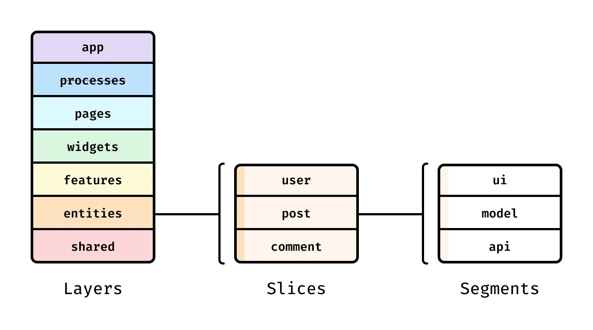

# React + Vite

This template provides a minimal setup to get React working in Vite with HMR and some ESLint rules.

Currently, two official plugins are available:

- [@vitejs/plugin-react](https://github.com/vitejs/vite-plugin-react/blob/main/packages/plugin-react) uses [Babel](https://babeljs.io/) for Fast Refresh
- [@vitejs/plugin-react-swc](https://github.com/vitejs/vite-plugin-react/blob/main/packages/plugin-react-swc) uses [SWC](https://swc.rs/) for Fast Refresh

## Expanding the ESLint configuration

If you are developing a production application, we recommend using TypeScript with type-aware lint rules enabled. Check out the [TS template](https://github.com/vitejs/vite/tree/main/packages/create-vite/template-react-ts) for information on how to integrate TypeScript and [`typescript-eslint`](https://typescript-eslint.io) in your project.


### Работа с API

github.com/typicode/jsob-server

```bash
npm install -D json-server@1.0.0-beta.3

```

### запускаем сервер в отдельном окне
```bash
npm run server
```

### стилизация компонентов

#### поддержка scss

```bash
npm i -D sass
```

модульные стили:
переименуем
button.scss -> Button.module.scss

// модульные стили позволяют использовать классы, которые не конфликтуют с другими классами в проекте
import styles from './Button.module.scss';


### Анимации в React без библиотек. Плавные переходы с помощью CSS и состояний

### Архитектура React-приложения. Как структурировать проект. Методология Featured-Sliced Design
https://fsd.how/ru/docs/get-started/overview/




